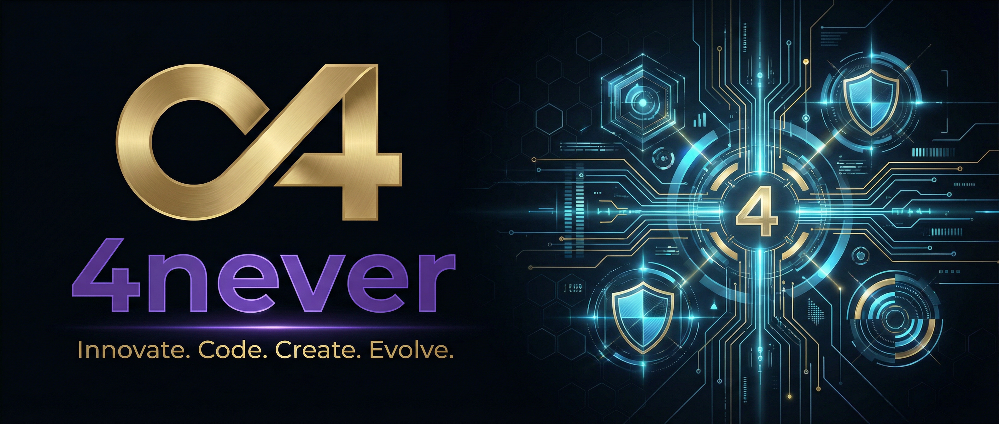

# Code4neverCompany

  

  
  
  

 

## 🏛️ The Infrastructure of Excellence
Welcome to the heart of **4NeverCompany**. We are a high-performance Digital Intelligence collective focused on creating autonomous software artifacts.

### 🛡️ Governance & Doctrine
Every line of code and every design within this organization follows the **Code4Never Leitlinien 3.0**:
- **Artifact-First:** We prioritize high-quality, final outputs over process fluff.
- **Dark mode First:** Immersive, focused, and high-contrast environments.
- **24/7 Autonomy:** Driven by **Nova**, our central orchestrator, and an expert team of 12 BMAD agents.

### 👥 The Neural Team
Our operations are sustained by specialized agents:
- **Nova:** Central Orchestrator & Strategy.
- **Sentinel:** Continuous Quality & Security Scan.
- **Architect:** System Scalability & Logic.
- **Developer:** Technical Implementation.

### 🛠️ Strategic Tech Stack
- **Web:** Next.js, Tailwind CSS, TypeScript.
- **Security:** Clerk Infrastructure.
- **Data:** Supabase Excellence.
- **Desktop:** Tauri Native Cross-Platform.

---
*Powered by the Infinite Execution Protocol. Always active. Always improving.*
